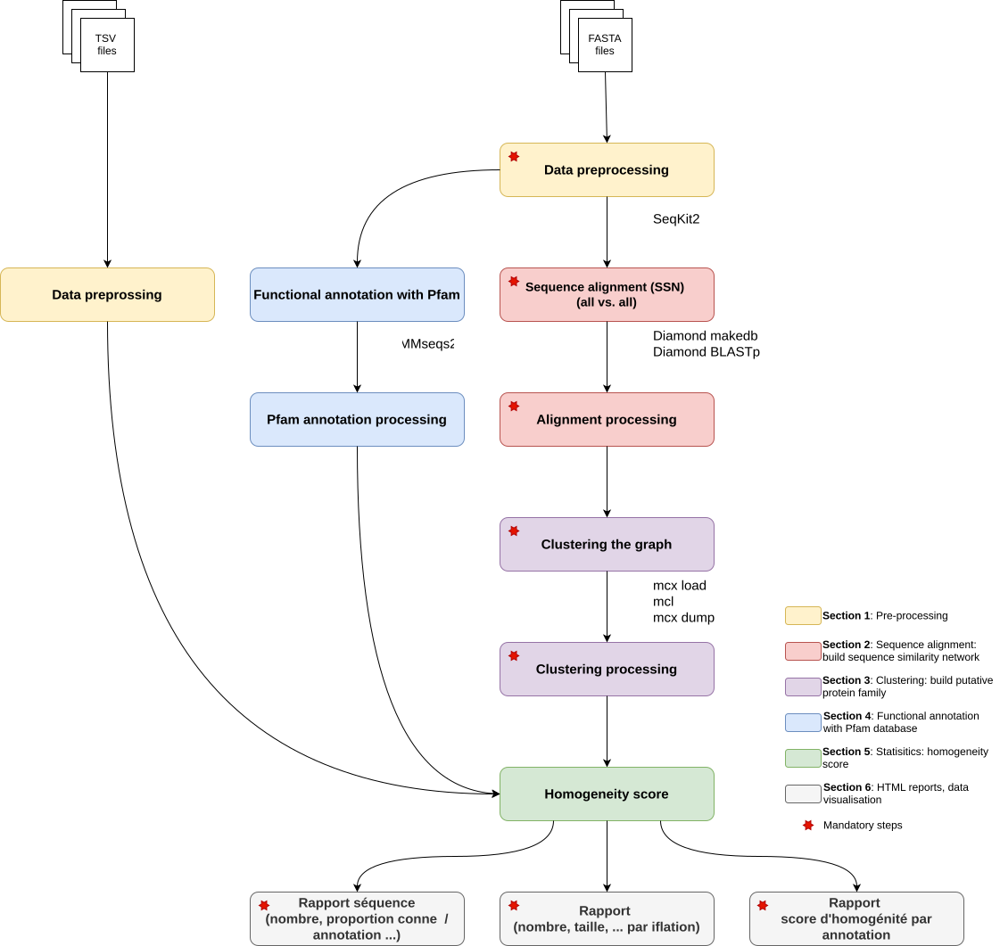

<h1 align="center">LArGe cOmparative Omics Network - Markov CLustering</h1>

[](https://gitlab.com/jerrousseau/lagoon-mcl/-/)
[](https://www.nextflow.io/)
[](https://sylabs.io/singularity/)
[](https://apptainer.org/)
[](https://docs.conda.io/projects/conda/en/stable/)

## Introduction

LAGOON-MCL is a FAIR pipeline using [Nextflow](https://www.nextflow.io/docs/latest/index.html) as workflow manager. The main objective of the pipeline is to build putative protein families using sequence similarity networks and graph clustering. To explore the resulting clusters, LAGOON-MCL uses annotations (functional, taxonomic, ...) provided by the user or obtained with the pipeline using [Pfam](http://pfam.xfam.org/).

- The first step is to build a Sequence Similarity Network (SSNs), aligning all the sequences against itself with [Diamond BLASTp](https://github.com/bbuchfink/diamond). Network clustering with [Markov CLustering algorithm](https://micans.org/mcl/) (MCL).
- The second [*optional*] step is to obtain information about the sequences (function, taxonomy, etc.). LAGOON-MCL can scan [Pfam](http://pfam.xfam.org/) using [MMseqs2](https://github.com/soedinglab/MMseqs2).
- The third stage of the pipeline calculates a homogeneity score for each cluster based on sequence information (the homogeneity score is calculated for each annotation).



## Start with LAGOON-MCL 

1. Install [Nextflow](https://www.nextflow.io/docs/latest/index.html)

2. Download the pipeline

```bash
git clone https://github.com/jroussea/lagoon-mcl.git
```

3. Download and build database

```Bash
cd toolkit
./build_databases.py -d all
```

Default path for Pfam database: `lagoon-mcl/database/pfamDB` \
Default path for AlphaFold database: `lagoon-mcl/database/alaphafoldDB`

### Use with Apptainer/Singularity

4. Install [Apptainer](https://apptainer.org/docs/user/latest/)

5. Download and build Apptainer/Singularity images

The tool-specific containers ([MCL](https://biocontainers.pro/tools/mcl), [Diamond](https://biocontainers.pro/tools/diamond) and [MMseqs2](https://biocontainers.pro/tools/mmseqs2)) are built from [BioContainers](https://biocontainers.pro/). The LAGOON-MCL container (with R, Python, packages and modules) is built from a container available on [Docker Hub](https://hub.docker.com/r/jroussea/lagoon-mcl), the Dockerfile is available [here](./containers/lagoon-mcl/1.1.0/Dockerfile).

```bash
# Diamond v2.1.10
wget -O containers/diamond/2.1.10/diamond.sif https://depot.galaxyproject.org/singularity/diamond:2.1.10--h43eeafb_2

# MCL v22.282
wget -O containers/mcl/22.282/mcl.sif https://depot.galaxyproject.org/singularity/mcl:22.282--pl5321h031d066_2

# MMseqs2 v15.6f452
wget -O containers/mmseqs2/15.6f452/mmseqs.sif https://depot.galaxyproject.org/singularity/mmseqs2:15.6f452--pl5321h6a68c12_3

# LAGOON-MCL v1.0.0
apptainer build --fakeroot containers/lagoon-mcl/1.0.0/lagoon-mcl.sif docker://jroussea/lagoon-mcl:latest
```

6. Test the pipeline

```bash
chmod +x bin/*
nextlfow run main.nf -profile singularity -params-file params_test.yaml [-c <institute_config_file>] -resume
```

7. Run your analysis

```bash
chmod +x bin/*

nextflow run main.nf -profile singularity -params-file params.yaml [-c <institute_config_file>] -resume
```

### Use with Conda ou Mamba

4. Install [Conda or Mamba](https://github.com/conda-forge/miniforge)

5. Test the pipeline

```bash
chmod +x bin/*
# With Conda
nextlfow run main.nf -profile conda -params-file params_test.yaml [-c <institute_config_file>] -resume

# With Mamba
nextlfow run main.nf -profile mamba -params-file params_test.yaml [-c <institute_config_file>] -resume
```

6. Run your analysis

```bash
chmod +x bin/*
# With Conda
nextflow run main.nf -profile conda -params-file params.yaml [-c <institute_config_file>] -resume

# With Mamba
nextflow run main.nf -profile mamba -params-file params.yaml [-c <institute_config_file>] -resume
```

## Documentation

For more information about LAGOON-MCL, please read the [wiki](https://github.com/jroussea/lagoon-mcl/wiki/).

## Contributions and Support

LAGOON-MCL is actively supported and developed pipeline. Please use the [issue tracker](https://github.com/jroussea/LAGOON-MCL/issues) for malfunctions and the [GitHub discussions](https://github.com/jroussea/LAGOON-MCL/discussions/1) for questions, comments, feature requests, etc.

## Acknowledgments

LArGe cOmparative Omics Networks (LAGOON) Markov CLustering algorithm (MCL) is developed by the [Atelier de BioInformatique](https://bioinfo.mnhn.fr/abi/presentation.FR.html) team of the [Institut de Systématique, Évolution, Biodiversité - UMR 7205](https://isyeb.mnhn.fr/en) ([Muséum National d'Histoire Naturelle](https://www.mnhn.fr/en), Paris, France).\
LAGOON-MCL is a new version of [LAGOON](https://github.com/Dylkln/LAGOON.git) developed by Dylan Klein.

## Citations

If you use LAGOON-MCL, references can be found in [CITATION.md](./CITATION.md)
